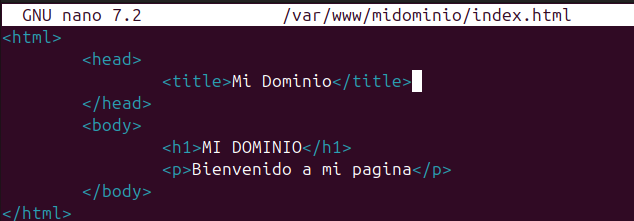
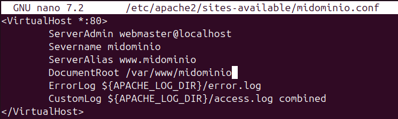
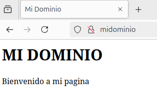

# Instalación y Configuración de Apache en Ubuntu 24

Este proyecto documenta el proceso completo de despliegue de un servidor web Apache en Ubuntu 24.04, incluyendo la gestión de hosts virtuales.

## 📝 Descripción del Proyecto
Guía técnica para la instalación, securización básica mediante firewall y configuración de dominios personalizados (Virtual Hosts) en un entorno Linux.

## 🛠️ Tecnologías Utilizadas
- **SO:** Ubuntu 24.04 LTS
- **Servidor Web:** Apache2
- **Seguridad:** UFW (Uncomplicated Firewall)
- **Gestión de Servicios:** Systemd (systemctl)

## 🚀 Instrucciones de Instalación y Ejecución

### 1. Instalación y Firewall
Actualice los repositorios e instale el paquete principal:
```bash
sudo apt update
sudo apt install apache2
```

Configure el firewall para permitir tráfico HTTP:
```bash
sudo ufw allow 'Apache'
sudo ufw enable
sudo ufw status
```

### 2. Gestión del servicio
Para comprobar el estado o modificar el comportamiento del inicio:
```bash
# Ver estodo del servicio
sudo systemctl status apache2

# Desactivar/Activar inicio automático
sudo systemctl disable apache2
sudo systemctl enable apache2
```

### 3. Configuración de Host Virtual
Para desplegar un sitio web personalizado (**midominio**):

1. **Preparar directorios:**
```bash
sudo mkdir /var/www/midominio
sudo chown -R $USER:$USER /var/www/midominio
sudo chmod -R 755 /var/www/midominio
```

2. **Crear sitio web:**
Crear un archivo **index.html** en **/var/www/midominio/** .


3. **Configurar Apache:**
Cree el archivo de configuración en **/etc/apache2/sites-available/midominio.conf** y habilítelo:
```bash
sudo nano /etc/apache2/sites-available/midominio.conf
```


```bash
sudo a2ensite midominio.conf
sudo a2dissite 000-default.conf
sudo apache2ctl configtest
sudo systemctl restart apache2
```

4. **Resolución local:**
Añada su IP y dominio al archivo **/etc/hosts/** :
```bash
sudo nano /etc/hosts
```
Añada en el lo siguiente:
```bash
# ip_equipo nombre_dominio
# ejemplo: 192.168.0.10 midominio
```

5. **Comprobación:**
En su navegador inserte **nombre_dominio** y deberia poder ver su página web:

